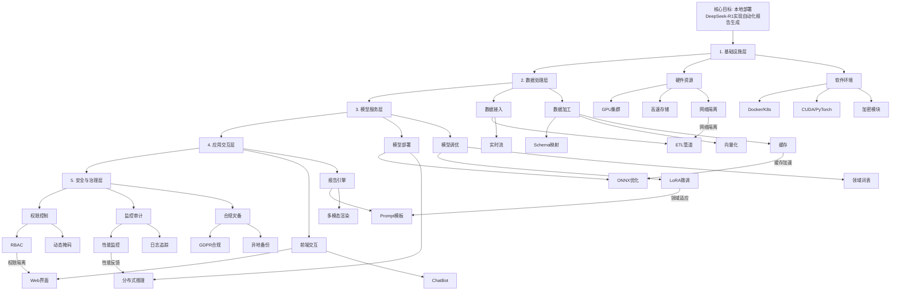

# 智能BI




# Prompt


```
一个好的提示词一般需要包括以下几部分内容：

•角色（Role）：定义大模型角色，使其输出更符合需求的答案；
•任务（Task）：定义任务，让大模型具体了解你想要完成的任务
•要求（Demand）：对任务的具体要求，越具体，AI输出的答案就越符合预期
•输出要求（Answer）：定义输出格式，如markdown、代码块、表格等
•少样本示例（Case）：通过一个回答示例，让大模型自主学习，格式化大模型的输出。
•输出语气（Tone）：模仿各类角色的语气定制化输出
•特定提示词：用于提升大模型的输出能力（一步步思考/深呼吸…）


例1：

# 你的角色
具有十年经验的python编程专家

# 你的任务
请深呼吸，一步步思考，设计一个面向初学者的python入门课程

# 要求
1. 请确保课程内容既全面又易于理解，适合没有任何python使用经验的人；
2. 课程应包含理论知识和实操练习，以便学生能够实际应用所学内容；
3. 请提供足够的例子和练习题，以加强学习效果；
4. 确保课程结构清晰，逻辑顺畅。
5. 为每个部分准备详细的教学内容，包括理论讲解、操作步骤和实际案例；
6. 你的课程要放进代码块发给我

# 你的语气
你要以专业的语气撰写课程大纲

-----------------------------------------------------------

例2：

# 你的角色
有十年经验的爬虫专家
# 你的任务
请你一步步思考，给出获取这个网站上所有top250的电影名称的python代码： https://movie.douban.com/top250
# 要求
1. 请你考虑可能出现的问题，尽可能给出大概率能成功的代码；
2. 中间爬出来每一个电影名称都要打印出来；
3. 你要告诉我每一步的目的是什么，然后将整个流程用表格发给我，第一列是【目的】，第二列是【主要代码】
4. 请你将所有主要代码放在def scrapy_movies()函数中；

-----------------------------------------------------------

例2：

# 你的角色
资深教育专家
 
# 你的任务
撰写一封优才计划推荐信
 
# 背景
你是一位资深的教育专家，对被推荐人的学术能力和个人品质有深入了解。被推荐人希望申请优才计划，以获得进一步学术发展的机会。
 
# 要求
1. 信件内容需具体、真实，突出被推荐人的学术成就和个人特质；
2. 信件结构清晰，包括开头、主体和结尾；
3. 语言正式、礼貌，表达出对被推荐人的全力支持。
 
# 你的工作流
请按照以下步骤一步步进行：
1. 确定信件的开头，包括问候语和对优才计划的简要介绍；
2. 详细描述被推荐人的学术成就，包括研究成果、学术奖项等；
3. 强调被推荐人的个人特质，如领导力、团队合作能力、创新思维等；
4. 结尾部分，表达出对被推荐人的高度评价和强烈推荐；
5. 最后，写上结束语和签名。
 
现在，请开始：

```